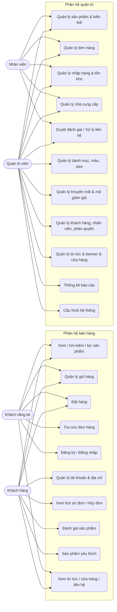
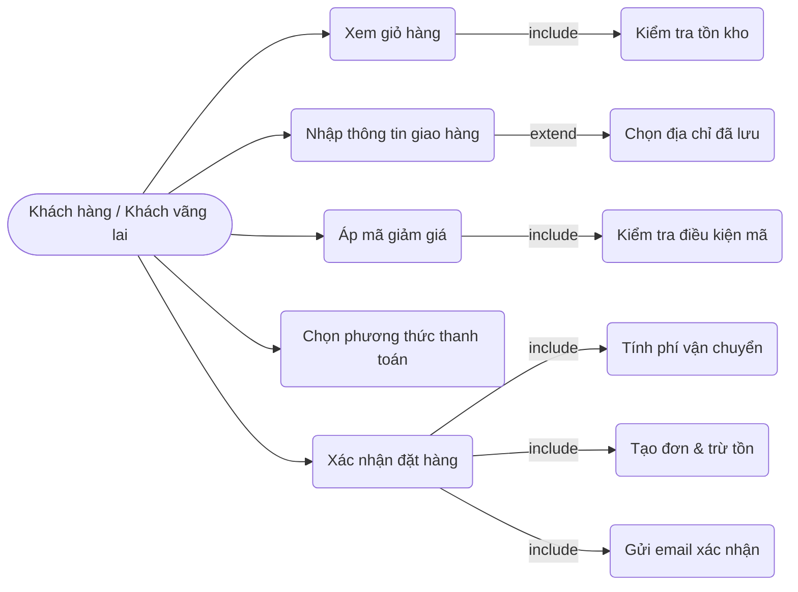
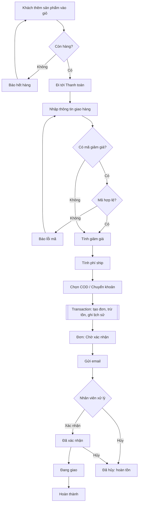
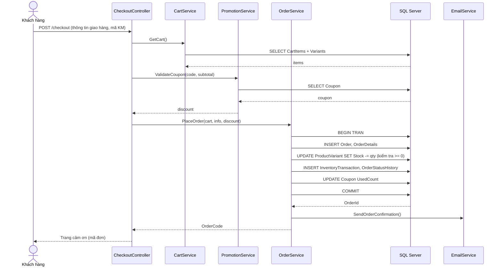

# CHƯƠNG 3. KHẢO SÁT VÀ PHÂN TÍCH HỆ THỐNG

## 3.1. Khảo sát hiện trạng

### 3.1.1. Giới thiệu cửa hàng
- **Tên thương hiệu:** Thời trang gia đình VT (Việt Thắng).
- **Website hiện tại:** https://thoitrangvietthang.vn/ (nền tảng Nhanh.vn).
- **Lĩnh vực:** đồ mặc nhà, đồ bộ, đồ ngủ; chất liệu chủ yếu lanh (linen), cotton, thun lạnh.
- **Nhóm khách hàng:** Nữ, Trung niên, Trẻ em (bé trai, bé gái), Nam.
- **Liên hệ:** Hotline 1800 6468 59, email info@thoitrangvietthang.vn, hệ thống cửa hàng tại Hà Nội.

### 3.1.2. Cấu trúc website hiện tại
Menu chính: Hàng mới về · Nữ · Trung niên · Trẻ em · Nam · Sale · Cửa hàng · Tin tức · Tuyển dụng.

Danh mục con (ví dụ):
- **Nữ:** Bộ đồ quần đùi, Bộ đồ quần lửng, Bộ đồ quần dài, Đồ lẻ (áo, quần), Đồ teen.
- **Trung niên:** Bộ quần lửng, Bộ quần dài, Áo, Chân váy.
- **Trẻ em:** Bé trai, Bé gái.
- **Nam:** Bộ đồ, Đồ lẻ.

### 3.1.3. Đặc điểm nghiệp vụ rút ra
| Đặc điểm | Ảnh hưởng đến thiết kế |
|---|---|
| Một sản phẩm có nhiều **màu** và **size** (S, M, L, XL, XXL; trẻ em theo số tuổi) | Cần bảng biến thể (ProductVariant), tồn kho theo biến thể |
| Giá bán lẻ 200.000đ – 500.000đ, thường **giảm 10–30%** | Cần cơ chế khuyến mãi theo % hoặc số tiền, có thời hạn |
| **Miễn phí vận chuyển** cho đơn từ 500.000đ | Quy tắc phí ship cấu hình được |
| Nhãn "Hàng mới về", "Sale" | Cờ IsNew, tính giá sau khuyến mãi |
| Có mục Tin tức, hệ thống cửa hàng, tuyển dụng | Bảng Post (tin tức/tuyển dụng), Store |
| Hình ảnh sản phẩm theo từng màu | ProductImage gắn với Color (tùy chọn) |

### 3.1.4. Hạn chế của hệ thống hiện tại
- Không quản lý nhập hàng, nhà cung cấp và tồn kho gắn với đơn online.
- Báo cáo doanh thu phụ thuộc gói dịch vụ của nền tảng.
- Không tùy biến quy trình xử lý đơn hàng nội bộ và phân quyền nhân viên theo nhu cầu.

## 3.2. Tác nhân (Actors)

| Tác nhân | Mô tả |
|---|---|
| **Khách vãng lai (Guest)** | Người truy cập chưa đăng nhập. Xem sản phẩm, đặt hàng không cần tài khoản. |
| **Khách hàng (Customer)** | Đã đăng ký tài khoản. Có thêm quản lý tài khoản, lịch sử đơn, đánh giá, yêu thích. |
| **Nhân viên (Employee)** | Nhân viên cửa hàng: xử lý đơn hàng, quản lý sản phẩm, nhập hàng, xem kho, duyệt đánh giá, trả lời liên hệ. |
| **Quản trị viên (Admin)** | Chủ cửa hàng/quản lý: toàn quyền của nhân viên + quản lý danh mục, khuyến mãi, tài khoản, phân quyền, nhà cung cấp, nội dung, báo cáo, cấu hình. |

## 3.3. Yêu cầu chức năng

### 3.3.1. Phân hệ khách hàng (Storefront)

| Mã | Chức năng | Mô tả | Tác nhân |
|---|---|---|---|
| KH01 | Xem trang chủ | Banner, danh mục nổi bật, hàng mới về, sản phẩm khuyến mãi, bán chạy, tin tức mới | Guest, Customer |
| KH02 | Duyệt danh mục | Danh mục nhiều cấp, phân trang, sắp xếp (mới nhất, giá tăng/giảm, bán chạy) | Guest, Customer |
| KH03 | Tìm kiếm & lọc | Tìm theo tên/mã; lọc theo khoảng giá, màu, size, chất liệu, danh mục | Guest, Customer |
| KH04 | Xem chi tiết sản phẩm | Ảnh theo màu, chọn màu/size, hiển thị tồn, giá gốc/giá KM, mô tả, đánh giá, sản phẩm liên quan | Guest, Customer |
| KH05 | Giỏ hàng | Thêm/sửa số lượng/xóa biến thể; guest lưu session, customer lưu CSDL; kiểm tra tồn | Guest, Customer |
| KH06 | Áp mã giảm giá | Nhập mã, kiểm tra điều kiện (hạn, đơn tối thiểu, số lần dùng) | Guest, Customer |
| KH07 | Đặt hàng (Checkout) | Nhập thông tin nhận hàng, chọn phương thức thanh toán (COD/Chuyển khoản), tính phí ship, tạo đơn, trừ tồn, gửi email xác nhận | Guest, Customer |
| KH08 | Tra cứu đơn hàng | Theo mã đơn + số điện thoại (guest) | Guest |
| KH09 | Đăng ký / Đăng nhập / Quên mật khẩu | Identity, xác nhận email, đăng nhập Google (tùy chọn) | Guest |
| KH10 | Quản lý tài khoản | Cập nhật hồ sơ, đổi mật khẩu, sổ địa chỉ giao hàng | Customer |
| KH11 | Lịch sử đơn hàng | Xem danh sách/chi tiết đơn, theo dõi trạng thái, hủy đơn khi chưa xác nhận | Customer |
| KH12 | Đánh giá sản phẩm | Chấm sao + bình luận cho sản phẩm đã mua; chờ duyệt | Customer |
| KH13 | Sản phẩm yêu thích | Lưu/xóa sản phẩm yêu thích | Customer |
| KH14 | Tin tức & Tuyển dụng | Xem danh sách, chi tiết bài viết | Guest, Customer |
| KH15 | Hệ thống cửa hàng | Danh sách cửa hàng, địa chỉ, bản đồ | Guest, Customer |
| KH16 | Liên hệ | Gửi form liên hệ | Guest, Customer |

### 3.3.2. Phân hệ quản trị (Admin Area)

| Mã | Chức năng | Mô tả | Tác nhân |
|---|---|---|---|
| QT01 | Đăng nhập quản trị | Đăng nhập, phân quyền theo vai trò | Employee, Admin |
| QT02 | Dashboard | Số đơn hôm nay, doanh thu, đơn chờ xử lý, sản phẩm sắp hết hàng, biểu đồ nhanh | Employee, Admin |
| QT03 | Quản lý danh mục | CRUD danh mục nhiều cấp, thứ tự hiển thị, ẩn/hiện | Admin |
| QT04 | Quản lý sản phẩm | CRUD sản phẩm, mô tả rich-text, ảnh (nhiều ảnh, ảnh theo màu), cờ mới/nổi bật, ẩn/hiện | Employee, Admin |
| QT05 | Quản lý biến thể | Tạo biến thể theo ma trận màu × size, SKU, giá riêng (nếu có), xem tồn | Employee, Admin |
| QT06 | Quản lý màu sắc & size | CRUD danh mục màu, size | Admin |
| QT07 | Quản lý đơn hàng | Danh sách, lọc theo trạng thái/ngày, chi tiết, đổi trạng thái (Chờ xác nhận → Đã xác nhận → Đang giao → Hoàn thành / Đã hủy), in đơn, ghi lịch sử | Employee, Admin |
| QT08 | Quản lý khách hàng | Danh sách, chi tiết, lịch sử mua, khóa/mở tài khoản | Employee (xem), Admin |
| QT09 | Quản lý nhân viên & phân quyền | CRUD tài khoản nhân viên, gán vai trò | Admin |
| QT10 | Quản lý khuyến mãi | Chương trình giảm giá theo % hoặc số tiền, áp cho sản phẩm/danh mục, thời gian hiệu lực | Admin |
| QT11 | Quản lý mã giảm giá (Coupon) | CRUD mã, loại giảm, giá trị, đơn tối thiểu, số lần dùng, thời hạn | Admin |
| QT12 | Quản lý nhà cung cấp | CRUD nhà cung cấp | Employee, Admin |
| QT13 | Quản lý phiếu nhập hàng | Lập phiếu nhập theo NCC, thêm dòng biến thể/số lượng/giá vốn, duyệt phiếu → cộng tồn, ghi lịch sử kho | Employee, Admin |
| QT14 | Quản lý tồn kho | Xem tồn theo sản phẩm/biến thể, cảnh báo sắp hết, điều chỉnh tồn (kiểm kê), lịch sử xuất nhập | Employee, Admin |
| QT15 | Quản lý đánh giá | Duyệt/ẩn đánh giá | Employee, Admin |
| QT16 | Quản lý tin tức | CRUD bài viết (tin tức, tuyển dụng), rich-text, xuất bản | Admin |
| QT17 | Quản lý banner | CRUD banner trang chủ, vị trí, thứ tự | Admin |
| QT18 | Quản lý liên hệ | Xem, đánh dấu đã xử lý | Employee, Admin |
| QT19 | Quản lý cửa hàng | CRUD điểm bán | Admin |
| QT20 | Thống kê báo cáo | Doanh thu theo ngày/tháng/năm (line), đơn theo trạng thái (doughnut), top sản phẩm bán chạy (bar), doanh thu theo danh mục, tồn kho, lợi nhuận gộp (giá bán − giá vốn), xuất Excel | Admin |
| QT21 | Cấu hình hệ thống | Thông tin cửa hàng, hotline, phí ship mặc định, ngưỡng freeship, tài khoản ngân hàng | Admin |

## 3.4. Yêu cầu phi chức năng

| Nhóm | Yêu cầu |
|---|---|
| Hiệu năng | Trang danh mục tải < 2s với 1.000 sản phẩm; phân trang server-side; cache danh mục/menu. |
| Bảo mật | Mật khẩu băm (Identity), chống CSRF (AntiForgeryToken), chống XSS (Razor encoding, lọc HTML editor), chống SQL Injection (EF Core tham số hóa), phân quyền [Authorize(Roles)], HTTPS. |
| Khả dụng | Giao diện responsive (mobile/tablet/desktop), tiếng Việt, thao tác giỏ hàng bằng AJAX không tải lại trang. |
| Toàn vẹn dữ liệu | Trừ tồn trong transaction khi đặt hàng; không cho tồn âm; đơn lưu snapshot tên/giá tại thời điểm mua. |
| Bảo trì | Kiến trúc phân lớp, Repository/Service, Migration, log lỗi (Serilog). |
| Sao lưu | Backup CSDL định kỳ. |

## 3.5. Sơ đồ Use Case

### 3.5.1. Use case tổng quát

### 3.5.2. Use case phân rã "Đặt hàng"

## 3.6. Đặc tả use case chính

### UC-03: Đặt hàng
| Mục | Nội dung |
|---|---|
| Tác nhân | Khách vãng lai, Khách hàng |
| Điều kiện trước | Giỏ hàng có ít nhất 1 sản phẩm còn hàng |
| Luồng chính | 1. Khách chọn "Thanh toán" từ giỏ hàng. 2. Hệ thống kiểm tra tồn từng biến thể, hiển thị form giao hàng (tự điền nếu đã đăng nhập). 3. Khách nhập họ tên, SĐT, email, địa chỉ (tỉnh/quận/phường), ghi chú. 4. Khách nhập mã giảm giá (tùy chọn), hệ thống kiểm tra và tính lại tổng. 5. Hệ thống tính phí ship (miễn phí nếu ≥ ngưỡng cấu hình). 6. Khách chọn COD hoặc Chuyển khoản, nhấn "Đặt hàng". 7. Hệ thống trong 1 transaction: tạo Order + OrderDetail (snapshot giá), trừ tồn biến thể, ghi InventoryTransaction, tăng UsedCount coupon, ghi OrderStatusHistory. 8. Hiển thị trang cảm ơn với mã đơn, gửi email xác nhận. |
| Luồng thay thế | 2a. Biến thể hết hàng → thông báo, yêu cầu cập nhật giỏ. 4a. Mã không hợp lệ → báo lỗi, không áp dụng. 7a. Lỗi trừ tồn (tranh chấp) → rollback, báo khách thử lại. |
| Điều kiện sau | Đơn ở trạng thái "Chờ xác nhận", tồn kho đã giảm |

### UC-12: Xử lý đơn hàng
| Mục | Nội dung |
|---|---|
| Tác nhân | Nhân viên, Quản trị viên |
| Điều kiện trước | Đã đăng nhập với vai trò Employee/Admin |
| Luồng chính | 1. Chọn menu Đơn hàng, lọc theo trạng thái/ngày/từ khóa. 2. Mở chi tiết đơn. 3. Chọn hành động: Xác nhận / Bắt đầu giao / Hoàn thành / Hủy (kèm lý do). 4. Hệ thống kiểm tra chuyển trạng thái hợp lệ, cập nhật Order, ghi OrderStatusHistory (người đổi, thời gian). 5. Nếu Hủy: hoàn tồn kho, ghi InventoryTransaction; nếu Hoàn thành: cập nhật PaymentStatus = Đã thanh toán. 6. Gửi email thông báo cho khách. |
| Luồng thay thế | 4a. Chuyển trạng thái không hợp lệ (ví dụ Hoàn thành → Chờ xác nhận) → từ chối. |
| Điều kiện sau | Trạng thái đơn mới được lưu kèm lịch sử |

### UC-13: Lập phiếu nhập hàng
| Mục | Nội dung |
|---|---|
| Tác nhân | Nhân viên, Quản trị viên |
| Luồng chính | 1. Chọn "Tạo phiếu nhập", chọn nhà cung cấp, ngày nhập, ghi chú. 2. Thêm dòng: tìm sản phẩm → chọn biến thể (màu/size) → nhập số lượng, giá vốn. 3. Lưu nháp (Draft). 4. Nhấn "Duyệt nhập kho": hệ thống cộng tồn từng biến thể, ghi InventoryTransaction loại Import, cập nhật giá vốn gần nhất, chuyển phiếu sang Completed. |
| Luồng thay thế | 4a. Phiếu đã duyệt không sửa được; muốn sửa phải lập phiếu điều chỉnh. |

### UC-20: Thống kê báo cáo
| Mục | Nội dung |
|---|---|
| Tác nhân | Quản trị viên |
| Luồng chính | 1. Chọn khoảng thời gian (hôm nay/7 ngày/tháng/năm/tùy chọn). 2. Hệ thống tính: doanh thu (đơn Hoàn thành), số đơn theo trạng thái, top 10 sản phẩm bán chạy, doanh thu theo danh mục, giá vốn & lợi nhuận gộp, tồn kho hiện tại, sản phẩm sắp hết. 3. Hiển thị bằng biểu đồ Chart.js + bảng. 4. Xuất Excel (ClosedXML). |

## 3.7. Sơ đồ hoạt động – Luồng đặt hàng và xử lý đơn

## 3.8. Sơ đồ tuần tự – Đặt hàng

