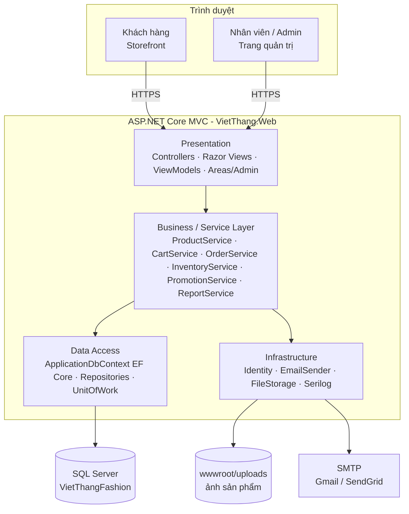
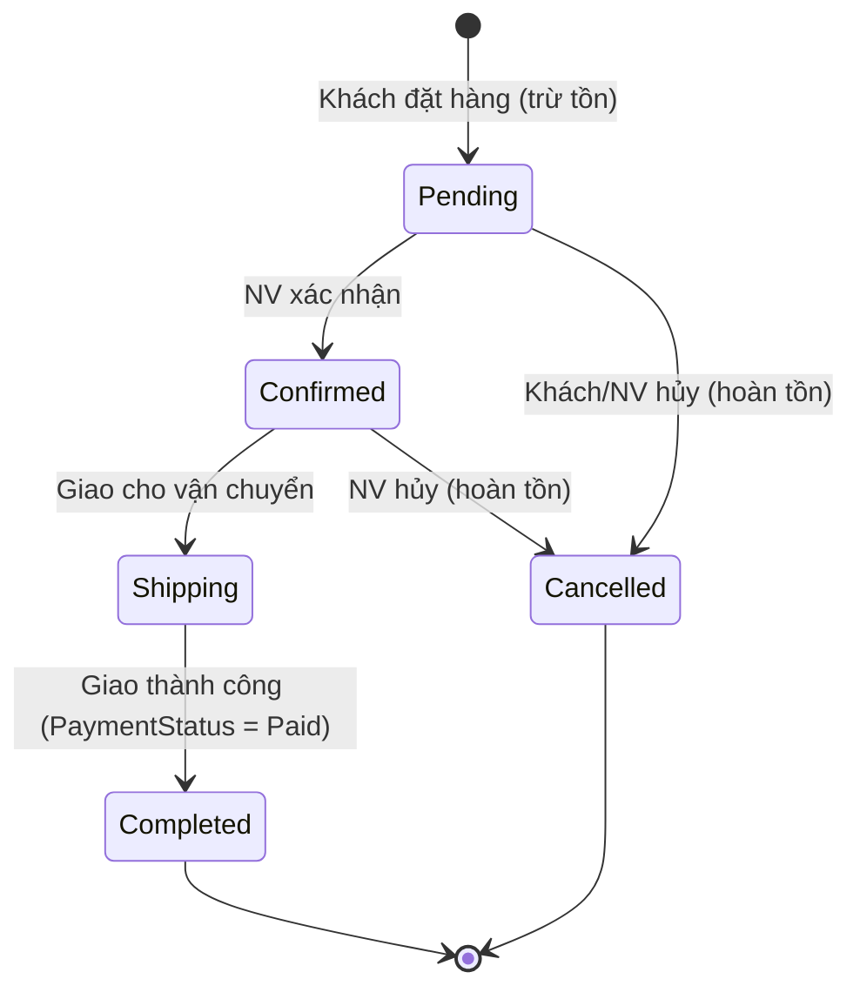
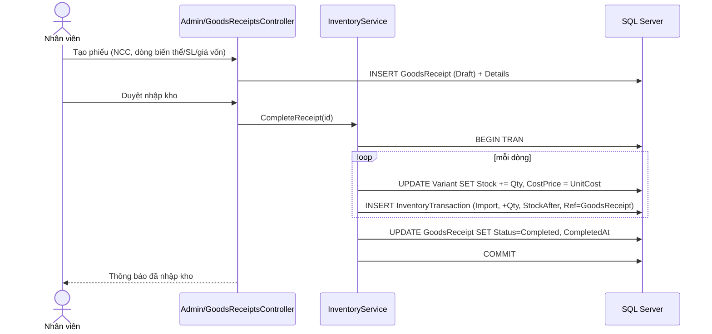

# CHƯƠNG 4 (phần 2). THIẾT KẾ KIẾN TRÚC HỆ THỐNG

## 4.7. Kiến trúc tổng thể

Ứng dụng web đơn khối (monolith) theo mô hình **ASP.NET Core MVC**, chia lớp theo trách nhiệm. Trang khách hàng và trang quản trị nằm trong cùng một ứng dụng, tách bằng **Areas** (`/Admin`).



**Lý do chọn:** phù hợp quy mô một cửa hàng, dễ triển khai (1 web app + 1 CSDL), dễ bảo vệ đồ án, vẫn tách lớp rõ để trình bày thiết kế.

## 4.8. Cấu trúc solution

Dự án dùng **một project** `VietThang.Web`, chia lớp bằng thư mục (đã chốt khi bắt đầu code, 14/09/2026). Cách này gọn, dễ chạy Migration, dễ trình bày; kiến trúc phân lớp vẫn thể hiện rõ qua thư mục Models – Data – Services – Controllers/Views.

```
VietThangFashion.sln
├── src/VietThang.Web/                 # ASP.NET Core MVC 8
│   ├── Models/
│   │   ├── Entities/                  # 27 entity (Product, ProductVariant, Order, GoodsReceipt, ...)
│   │   └── Enums/Enums.cs             # OrderStatus, PaymentMethod, InventoryType, ...
│   ├── Data/
│   │   ├── ApplicationDbContext.cs    # IdentityDbContext + Fluent API (index, unique, check, delete behavior)
│   │   ├── SeedData.cs                # roles, tài khoản mẫu, màu, size, danh mục, cấu hình, sản phẩm mẫu
│   │   └── Migrations/                # EF Core Migrations
│   ├── Services/                      # ProductService, CartService, OrderService, InventoryService,
│   │                                  # PromotionService, ReportService (Interfaces + Implementations)
│   ├── ViewModels/
│   ├── Controllers/                   # Storefront: Home, Products, Cart, Checkout, Account, Orders, Posts
│   ├── Views/                         # Shared/_Layout.cshtml, ...
│   ├── Areas/Admin/
│   │   ├── Controllers/               # AdminBaseController [Authorize(Roles="Admin,Employee")], Dashboard, ...
│   │   └── Views/
│   ├── wwwroot/ (css, js, images, uploads)
│   ├── appsettings.json               # ConnectionStrings:DefaultConnection
│   └── Program.cs
├── tests/VietThang.Tests/             # xUnit (làm ở tuần 13)
└── docs/                              # Tài liệu đồ án
```

**Môi trường phát triển:** SQL Server LocalDB `(localdb)\MSSQLLocalDB` (kèm Visual Studio, miễn phí, SSMS kết nối được). Khi triển khai chỉ cần đổi chuỗi kết nối sang SQL Server đầy đủ.

**Tài khoản seed:** admin@thoitrangvietthang.vn / Admin@123 (Admin); nhanvien@thoitrangvietthang.vn / NhanVien@123 (Employee); khachhang@gmail.com / KhachHang@123 (Customer).

## 4.9. Phân quyền

| Vai trò | Truy cập |
|---|---|
| Anonymous | Storefront công khai, đăng ký/đăng nhập, đặt hàng, tra cứu đơn |
| Customer | + `/account/*`, `/orders/*`, đánh giá, yêu thích, giỏ hàng lưu CSDL |
| Employee | `/Admin` trừ các mục chỉ Admin |
| Admin | Toàn bộ `/Admin` |

Cài đặt: `[Area("Admin")] [Authorize(Roles = "Admin,Employee")]` trên controller base của Admin; các controller Danh mục, Khuyến mãi, Coupon, Nhân viên, Tin tức, Banner, Báo cáo, Cấu hình dùng `[Authorize(Roles = "Admin")]`.

## 4.10. Luồng xử lý chính

### Máy trạng thái đơn hàng



### Luồng nhập kho



### Sinh mã đơn / mã phiếu
`VT` + `yyMMdd` + số thứ tự 3 chữ số trong ngày (VD `VT240914001`); phiếu nhập `PN` + `yyMMdd` + STT. Sinh trong transaction để tránh trùng.

## 4.11. Thiết kế giao diện (sitemap)

### Storefront
| Trang | Route | Nội dung chính |
|---|---|---|
| Trang chủ | `/` | Slider banner, 4 nhóm danh mục (Nữ/Trung niên/Trẻ em/Nam), Hàng mới về, Sale, Bán chạy, Tin tức |
| Danh mục | `/danh-muc/{slug}` | Sidebar lọc (danh mục con, giá, màu, size, chất liệu), grid sản phẩm, sắp xếp, phân trang |
| Tìm kiếm | `/tim-kiem?q=` | Kết quả + bộ lọc |
| Chi tiết SP | `/san-pham/{slug}` | Gallery ảnh theo màu, chọn màu/size, tồn kho, giá KM, mô tả, đánh giá, SP liên quan |
| Giỏ hàng | `/gio-hang` | Bảng sản phẩm, cập nhật SL (AJAX), mã giảm giá, tổng |
| Thanh toán | `/thanh-toan` | Form giao hàng, chọn địa chỉ đã lưu, phương thức thanh toán, tóm tắt đơn |
| Cảm ơn | `/thanh-toan/thanh-cong/{code}` | Mã đơn, hướng dẫn chuyển khoản nếu chọn |
| Tra cứu đơn | `/tra-cuu-don-hang` | Mã đơn + SĐT |
| Tài khoản | `/tai-khoan`, `/tai-khoan/dia-chi`, `/tai-khoan/don-hang` | Hồ sơ, sổ địa chỉ, lịch sử đơn, hủy đơn, đánh giá |
| Tin tức | `/tin-tuc`, `/tin-tuc/{slug}` | Danh sách, chi tiết |
| Tuyển dụng | `/tuyen-dung` | Bài viết loại Recruitment |
| Cửa hàng | `/he-thong-cua-hang` | Danh sách + bản đồ |
| Liên hệ | `/lien-he` | Form |

### Admin (`/Admin`)
Dashboard · Sản phẩm (danh sách, thêm/sửa, biến thể, ảnh) · Danh mục · Màu/Size · Đơn hàng · Khách hàng · Nhân viên · Khuyến mãi · Mã giảm giá · Nhà cung cấp · Phiếu nhập · Tồn kho (danh sách, điều chỉnh, lịch sử) · Đánh giá · Tin tức · Banner · Cửa hàng · Liên hệ · Báo cáo · Cấu hình.

Giao diện quản trị dùng template Bootstrap 5 (AdminLTE 4 hoặc SB Admin 2), sidebar trái, bảng có tìm kiếm/lọc/phân trang, form validation client + server.

## 4.12. Module báo cáo thống kê

| Báo cáo | Nguồn dữ liệu | Biểu đồ |
|---|---|---|
| Doanh thu theo ngày/tháng/năm | Orders (Status = Completed) group by CompletedAt | Line |
| Số đơn theo trạng thái | Orders group by Status | Doughnut |
| Top 10 sản phẩm bán chạy | OrderDetails join Orders (Completed) sum Quantity | Bar ngang |
| Doanh thu theo danh mục | OrderDetails → Variant → Product → Category | Pie |
| Lợi nhuận gộp | Σ (UnitPrice − CostPrice) × Quantity | Bar theo tháng |
| Tồn kho & sắp hết hàng | ProductVariants (StockQuantity ≤ LowStockThreshold) | Bảng |
| Khách hàng mới theo tháng | AspNetUsers (role Customer) group by CreatedAt | Line |

Số liệu trả về qua action JSON (`/Admin/Reports/RevenueData?from=&to=&groupBy=`), Chart.js vẽ ở client; nút **Xuất Excel** dùng ClosedXML.

## 4.13. Bảo mật & chất lượng
- Identity: mật khẩu ≥ 8 ký tự, khóa tài khoản sau 5 lần sai, xác nhận email.
- `[ValidateAntiForgeryToken]` trên mọi POST; Razor tự mã hóa output; nội dung HTML từ editor được lọc bằng HtmlSanitizer.
- Upload ảnh: kiểm tra định dạng/kích thước, đổi tên file GUID, lưu `wwwroot/uploads/products/{productId}/`.
- Trừ tồn dùng `UPDATE ... WHERE StockQuantity >= @qty` trong transaction, kiểm tra số dòng ảnh hưởng để chống bán âm khi đặt đồng thời.
- Serilog ghi log ra file; trang lỗi thân thiện; HTTPS redirect; HSTS.
- Unit test cho PricingService (tính giá KM, coupon, phí ship) và OrderStateMachine (chuyển trạng thái hợp lệ).

## 4.14. Gói NuGet dự kiến
```
Microsoft.AspNetCore.Identity.EntityFrameworkCore
Microsoft.EntityFrameworkCore.SqlServer
Microsoft.EntityFrameworkCore.Tools
Microsoft.AspNetCore.Identity.UI
Serilog.AspNetCore
HtmlSanitizer
ClosedXML
X.PagedList.Mvc.Core
MailKit
```
